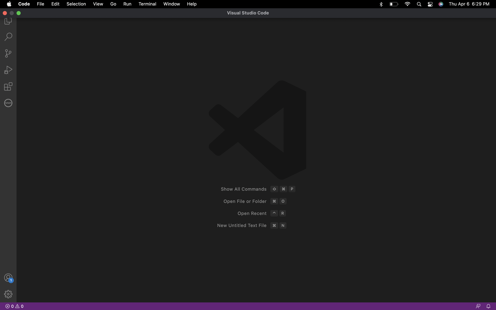

# **CSE15L Lab Report 1**

## by Marvin Peralta, A17271264

## **How to log into a course-specific account on 'ieng6'**

### **Step 1: Installing VSCode**

To install Visual Code Studio, you must go to https://code.visualstudio.com/ and follow the instructions on how to download it to your device. Instructions will vary depending on whether you are using windows or mac so be careful! After installing, open up VSCode and the application should look something like the image below, depending on the color scheme.

### **Step 2: Remotely Connecting**

For opening up the terminal, if you are on windows you have to install git at https://gitforwindows.org and set the default terminal "git bash" in VSCode through this tutorial https://stackoverflow.com/a/50527994, whereas if you are on a mac you can simply open up a terminal in  VSCode through the terminal menu at the top. Use the command:
`$ ssh cs15lsp23zz@ieng6.ucsd.edu`

Note that you should substitute zz to your own cse15l specific account. It will ask you if you want to connect, type 'yes' and type in your password for the account. Voila, you are connected!

### **Step 3: Trying Some Commands**

Finally, you should run some commands to get a feeling of how much access you have. Commands like `cd`, `ls`, `pwd`, `mkdir`, and `cp` can be run on both your computer and the remote computer after using ssh that is.

Other specific commands you can try are:
* `cd ~`
* `cd`
* `ls -lat`
* `ls <directory>` where `<directory>` is `/home/linux/ieng6/cs15lsp23/cs15lsp23abc`, where the `abc` is someone else's account username
* `cp /home/linux/ieng6/cs15lsp23/public/hello.txt ~/`
* `cat /home/linux/ieng6/cs15lsp23/public/hello.txt`

And you can always log out of the remote server using:
* Ctrl-D
* Run the command `exit`
