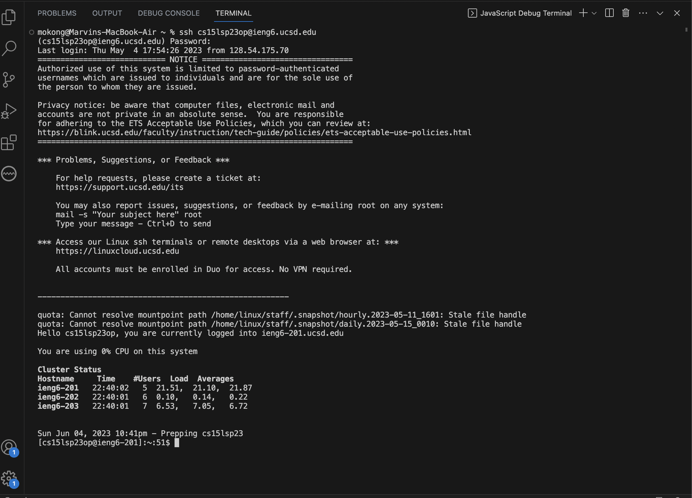
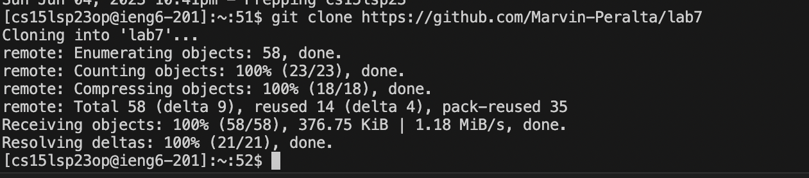
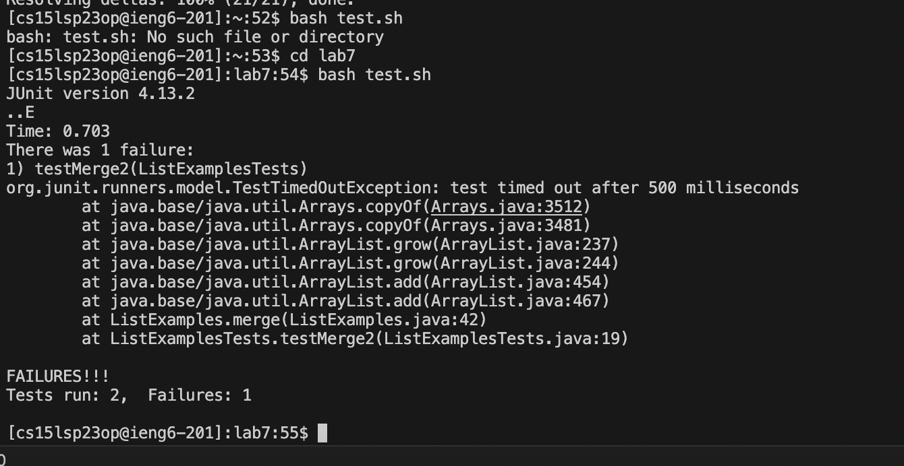
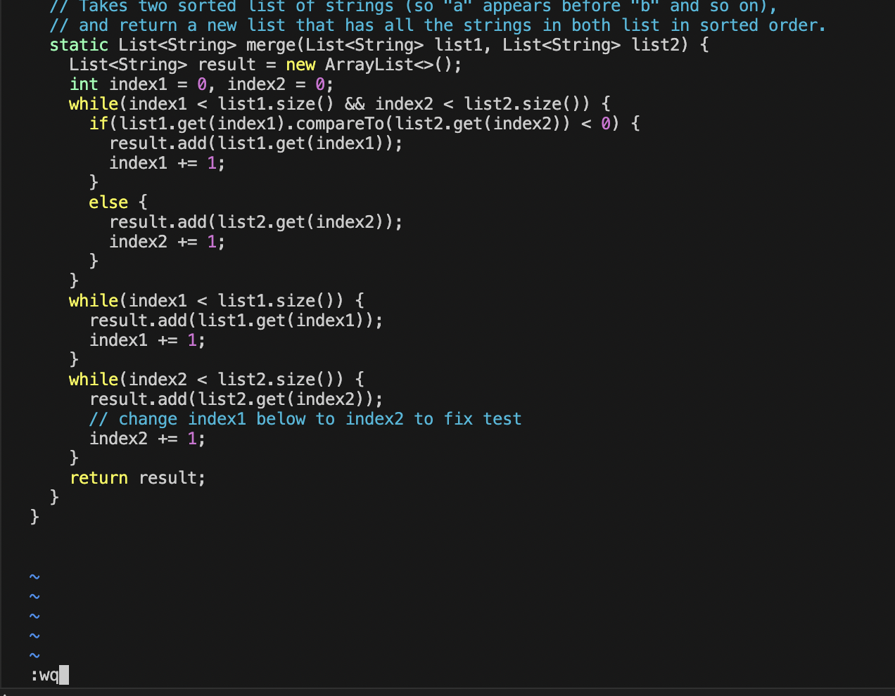
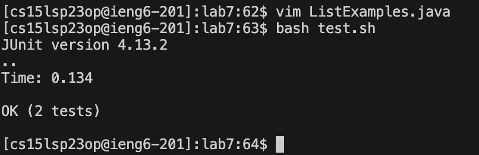
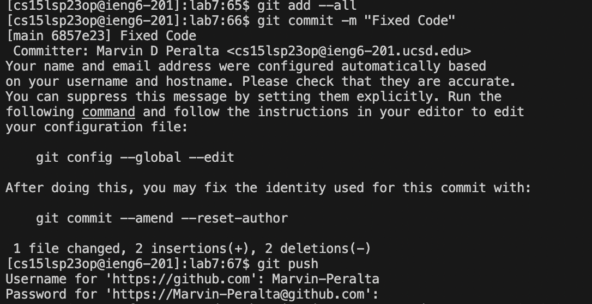

# **Lab Report 4**
## By Marvin Peralta, A17271264

## Command Line Editing (Steps 4-9)

### Step 4:

Time: 0:46.32

Keys Pressed:
- `<command>`+`<shift>`+`
` (pressed all at the same time)
- Pressed Terminal
- s s h `<space>` c s 1 5 l s p 2 3 o p @ i e n g 6 @ u c s d . e d u
- Typed my password (that's a secret)

### Step 5:

Time: 1:35.94
  
Keys Pressed:
- Copied forked repository URL
- g i t `<space>` c l o n e `<space>` `<command>` v

### Step 6:

Time: 2:08.23
  
Keys Pressed:
- c d `<space>` l a b 7
- b a s h `<space>` t e s t . s h

### Step 7:

Time: 3:28.84
  
Keys Pressed:
- v i m `<space>` L i s t E x a m p l e s . j a v a
- / c h a `<enter>` j l l x i 2 `<esc>` : w q `<enter>`

VIM Summary: 
- /cha `<enter>` - allows me to get to the comment "change index1 below index2 to fix test"
- j - moves the cursor down
- l - moves the cursor right
- x - deletes character that the cursor points to
- i - goes to insert mode
- 2 - I typed in 2 after index to fix the while loop
- `<esc>` - exits insert mode
- :wq `<enter>` - saves file changes and exits vim

### Step 8:

Time: 3:50.90
  
Keys Pressed:
- b a s h `<space>` t e s t . s h

### Step 9:

Time: 5:03.88
  
Keys Pressed:
- g i t `<space>` a d d `<space>` - - a l l
- g i t `<space>` c o m m i t `<space>` - m `<space>` " F i x e d `<space>` C o d e "
- g i t `<space>` p u s h
- M a r v i n - P e r a l t a (typed my github username)
- Typed my github password (that is also a secret)
  
  
Summary:
All characters typed are separated by spaces (the only spaces that count are the ones formatted as <space>. Before I started the timer, I looked over the repository and saw that the comment regarding what to change in ListExamples.java so I just used the find key in vim: / followed by "cha" allowing me to get the vim pointer directly on the word "change" and after a few cursor movements, I was able to get to what needed to be removed and inserted in only a few key presses instead of pressing j 40 times.
