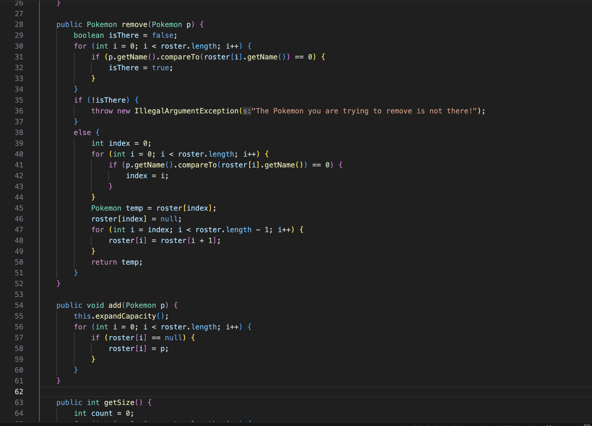
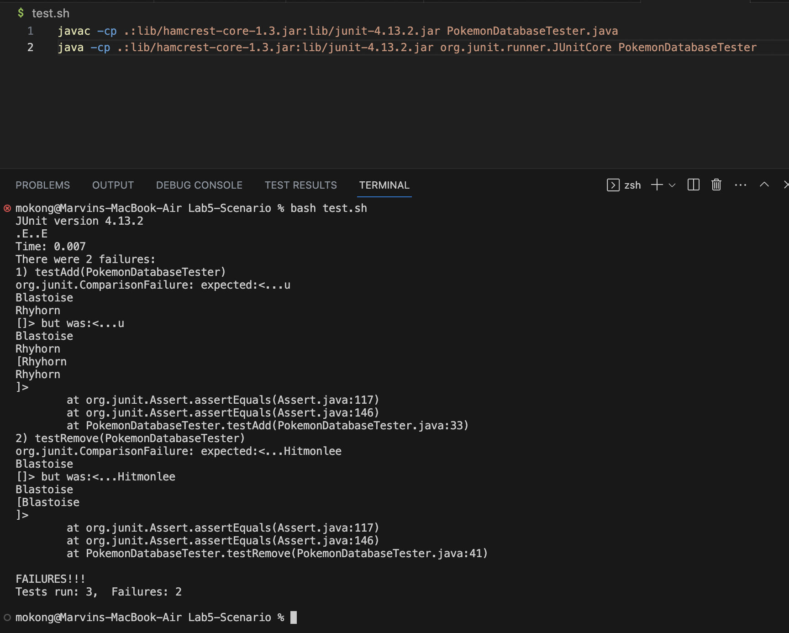
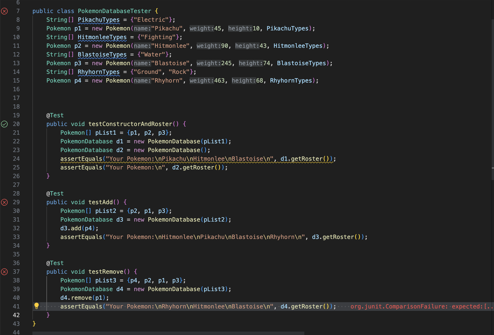
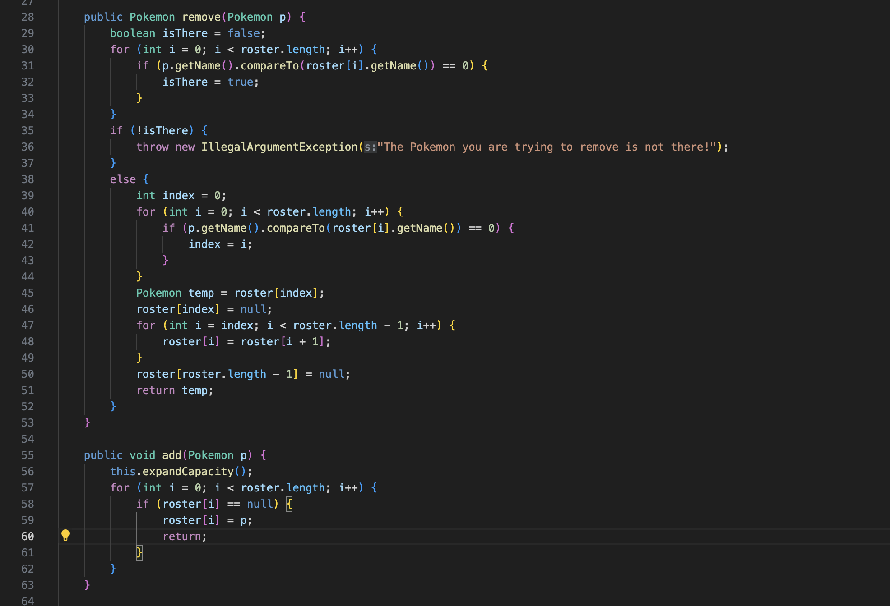
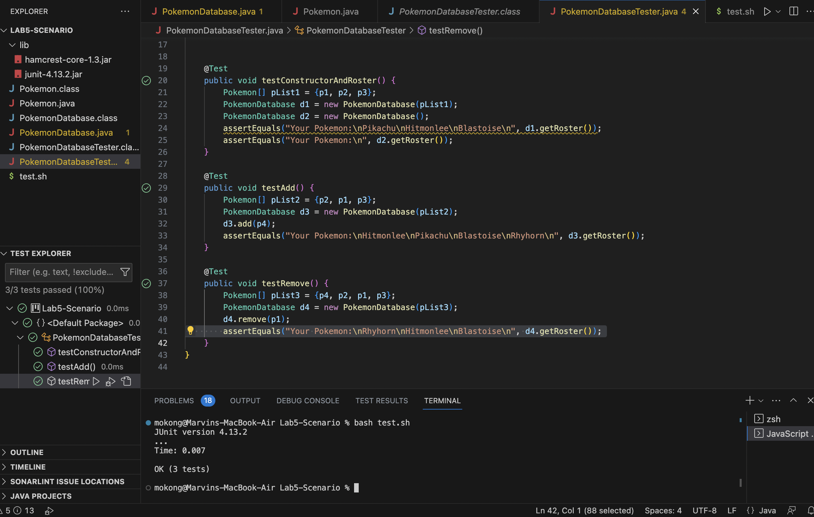

# Lab Report 5

## By Marvin Deleon Peralta Jr, A17271264

### Part 1: Debugging Scenario

#### Student Question:

Hello, I hope whichever TA reads this, finds it in good health. My Pokemon class file seems to be bugless, but I'm having a tough time figuring out what is wrong with my PokemonDatabase class file when it comes to the `add()` and `remove()` methods.







When I run `bash test.sh` it says that 2 tests have failed, the `testAdd()` and `testRemove()` method testers. However, there are not any compile or runtime errors in my PokemonDatabae.java file, let alone my Pokemon.java file. What could be the issue to this problem?

#### TA Response:

The test.sh file seems be alright and should not be fixed. If what you say is true and the Pokemon.java file works as intended, then the source of these test failures could be that the array is being updated more times (or less) than what it should be. Try adding `System.out.println()` lines in between certain lines of both add and remove methods. Remember that `return;` acts the same as `break` but instead of exiting out of loops, it exits out of the method for void types of methods. 

#### Student Response:

Hi, again. Thank you for the information! With `System.out.println()` statements in my for loops for both the `remove()` and `add()` methods, I was able to see that in `remove()` it did not set the last element to null which allowed for 2 Pokemon to exist in the last two indices of the roster array. In `add()` I was able to see that the Pokemon to be added was added mutiple times because it only directed if the roster index was null (in which the Pokemon to be added was substituted for every null value). Therefore, I changed the last value in the roster to be null for `remove()` and exited the method as soon as the first null element was substituted in as a Pokemon in `add()`





#### Interaction Summary:

The file and directory structure needed:

`PokemonDatabase.java`, `PokemonDatabaseTester.java`, and `test.sh`
They are all in a folder called `Lab5-Scenario` (The terminal started in that directory so it did not matter)

The contents of each file before fixing the bug:

Before:
```
public Pokemon remove(Pokemon p) {
    boolean isThere = false;
    for (int i = 0; i < roster.length; i++) {
        if (p.getName().compareTo(roster[i].getName()) == 0) {
            isThere = true;
        }
    }
    if (!isThere) {
        throw new IllegalArgumentException("The Pokemon you are trying to remove is not there!");
    }
    else {
        int index = 0;
        for (int i = 0; i < roster.length; i++) {
            if (p.getName().compareTo(roster[i].getName()) == 0) {
                index = i;
            }
        }
        Pokemon temp = roster[index];
        roster[index] = null;
        for (int i = index; i < roster.length - 1; i++) {
            roster[i] = roster[i + 1];
        }
        return temp;
    }
}
public void add(Pokemon p) {
    this.expandCapacity();
    for (int i = 0; i < roster.length; i++) {
        if (roster[i] == null) {
            roster[i] = p;
        }
    }
}
```

After:
```
public Pokemon remove(Pokemon p) {
    boolean isThere = false;
    for (int i = 0; i < roster.length; i++) {
        if (p.getName().compareTo(roster[i].getName()) == 0) {
            isThere = true;
        }
    }
    if (!isThere) {
        throw new IllegalArgumentException("The Pokemon you are trying to remove is not there!");
    }
    else {
        int index = 0;
        for (int i = 0; i < roster.length; i++) {
            if (p.getName().compareTo(roster[i].getName()) == 0) {
                index = i;
            }
        }
        Pokemon temp = roster[index];
        roster[index] = null;
        for (int i = index; i < roster.length - 1; i++) {
            roster[i] = roster[i + 1];
        }
        roster[roster.length - 1] = null;
        return temp;
    }
}
public void add(Pokemon p) {
    this.expandCapacity();
    for (int i = 0; i < roster.length; i++) {
        if (roster[i] == null) {
            roster[i] = p;
            return;
        }
    }
}
```

The full command line (or lines) you ran to trigger the bug:

`bash test.sh`
(Bug found through setting up `System.out.println(roster[i)` at the end of the second for loop in `remove()` and the end of the only for loop in `add()`

A description of what to edit to fix the bug:

In the `remove()` method, the last element and the second to last element of the roster array are duplicates. The last element should be set to null. In the `add()` method, the method needs to break after setting a Pokemon to a null value in the roster array.

### Part 2: Reflection

Although it may be a large portion of the second half of the quarter, I learned that you could use an entire file to run commands for you. I never really gave a thought into the idea that you could run an .sh file by typing `bash <filename>`. When the lessons came up about TAs using grade.sh to run various commands when given student coding files, it felt like an obvious feature that I just never thought about. 
