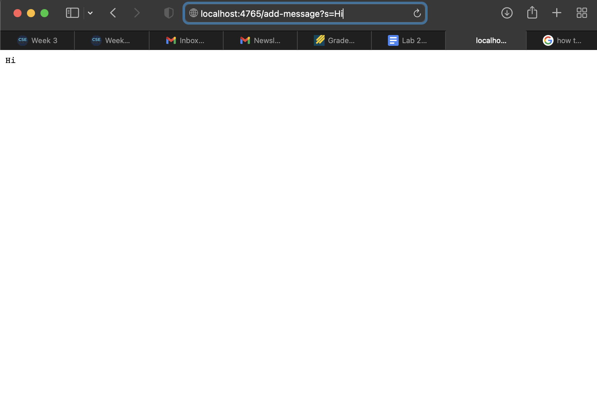
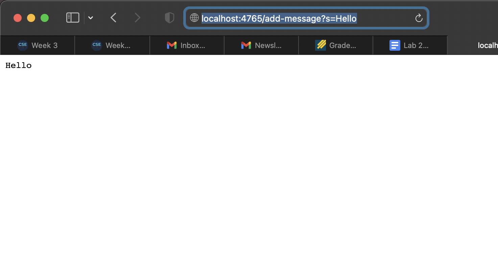

# **CSE15L Lab Report 2**
## By Marvin Peralta, A17271264

### **Part 1**

I couldn't get the messages to add :(

### **Part 2**

`class EvenExample {
  static int sumEvenIndices(int[] num) {
    int sum = 0;
    for(int i = 0; i < nums.length; i += 2) {
      sum += nums[i + 1];
    }
    return sum;
  }
}`

`public void testSumEvenLength5() {
  int[] input1 = { 12, 13, 7, 2, 33};
  assertEquals(EvenExamples.sumEvenIndices(input1), 52);
}`
This test failed.

`public void testSumEvenLength6() {
  int[] input1 = { 12, 13, 7, 8, 5, 3};
  assertEquals(EvensExamples.sumEvenIndices(input1), 24);
}`
This test passed.

`for (int i = 0; i < nums.length; i += 2) {
  sum += nums[i + 1];
 }`
 
 `for (int i = 0; i < nums.length - 1; i += 2) {
    sum += nums[i + 1];
  }`
  
  Setting the limit of the for loop up until `i` is less than `nums.length - 1` makes it so that `sum` would not try to add a index from `nums` that is out of bounds, allowing both odd and even arrays to succeed when this method is used. 

### **Part 3**

I learned that you can change a web server's contents by simply portions of the URL. Of course, this does not apply to all sites, only those that are programmeed to do so, yet it is really interesting to alter the contents without having to change some of the coding.
