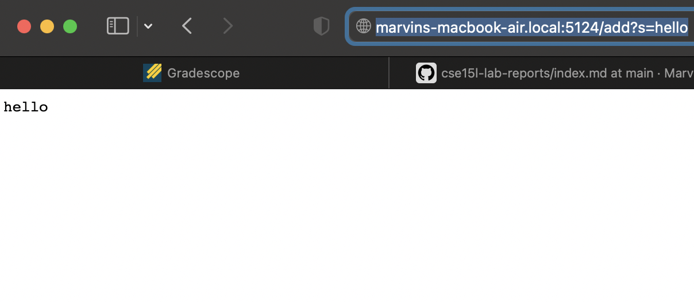
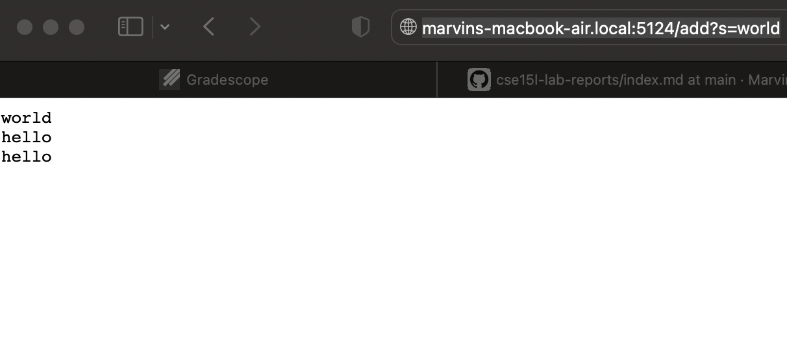
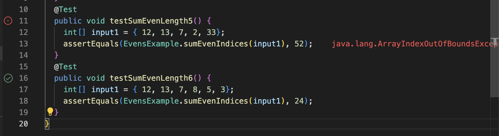

# **CSE15L Lab Report 2**
## By Marvin Peralta, A17271264

### **Part 1**

```
import java.io.IOException;
import java.net.URI;
import java.nio.file.Files;
import java.nio.file.Paths;
import java.util.List;
import java.util.Arrays;

class StringHandler implements URLHandler {
  List<String> lines;
  String path;
  StringHandler(String path) throws IOException {
    this.path = path;
    this.lines = Files.readAllLines(Paths.get(path));
  }
  public String handleRequest(URI url) throws IOException {
    String query = url.getQuery();
    if(url.getPath().equals("/add")) {
      if(query.startsWith("s=")) {
        String toAdd = query.split("=")[1];
        this.lines.add(toAdd);
        String fullLines = "";
        for (int i = this.lines.size() - 1; i >= 0; i--) {
          fullLines += this.lines.get(i) + "\n";
          System.out.println(fullLines);
        }
        return fullLines;
      }
      else {
        return "/add requires a query parameter s\n";
      }
    }
    else if(url.getPath().equals("/save")) {
      String toSave = String.join("\n", lines) + "\n";
      Files.write(Paths.get(this.path), toSave.getBytes());
      return "Saved!\n";
    }
    else if(url.getPath().equals("/search")) {
      if(query.startsWith("q=")) {
        String toSearch = query.split("=")[1];
        String result = "";
        for(String s: lines) {
          if(s.contains(toSearch)) {
            result += s + "\n";
          }
        }
        return result;
      }
      else {
        return "/search requires a query parameter q\n";
      }
    }
    else {
      return String.join("\n", lines) + "\n";
    }
  }
}

class StringServer {
  public static void main(String[] args) throws IOException {
    if(args.length == 0){
      System.out.println("Missing port number! Try any number between 1024 to 49151");
      return;
    }
    if(args.length == 1){
      System.out.println("Missing file path! Give a path to a text file as the second argument.");
      return;
    }

    int port = Integer.parseInt(args[0]);

    Server.start(port, new StringHandler(args[1]));
  }
}
```


DISCLAIMER: I used the Skill Demo's stringsearch-main code and edited some of its contents to do this lab report!

The main method was called to start the server (essentially calling the `start` method in Server.java, but because I ran the server to display an empty file called `labresub.txt`, I had to add the string `hello` through editing the URL, calling the `handleRequest` method.


Again, I edited the URL to add `world` so `handleRequest` was called again

Relevant arguments in the code are the URL containing any of the following:
`/add-message`
`/search`
`/save`
Whatever is added, saved, or searched is a string from a list of strings saved in labresub.txt (or there for the time being). So even if an int, char, or double are added, it will still be a string value.

The list of string append a string given `/add-message?s=<text>` is added to the URL where `text` is the string added.


### **Part 2**

`class EvenExample {
  static int sumEvenIndices(int[] num) {
    int sum = 0;
    for(int i = 0; i < nums.length; i += 2) {
      sum += nums[i + 1];
    }
    return sum;
  }
}`

`public void testSumEvenLength5() {
  int[] input1 = { 12, 13, 7, 2, 33};
  assertEquals(EvenExamples.sumEvenIndices(input1), 52);
}`
This test failed.

`public void testSumEvenLength6() {
  int[] input1 = { 12, 13, 7, 8, 5, 3};
  assertEquals(EvensExamples.sumEvenIndices(input1), 24);
}`
This test passed.



`for (int i = 0; i < nums.length; i += 2) {
  sum += nums[i + 1];
 }`
 
 `for (int i = 0; i < nums.length - 1; i += 2) {
    sum += nums[i + 1];
  }`
  
  Setting the limit of the for loop up until `i` is less than `nums.length - 1` makes it so that `sum` would not try to add a index from `nums` that is out of bounds, allowing both odd and even arrays to succeed when this method is used. 

### **Part 3**

I learned that you can change a web server's contents by simply portions of the URL. Of course, this does not apply to all sites, only those that are programmeed to do so, yet it is really interesting to alter the contents without having to change some of the coding.
